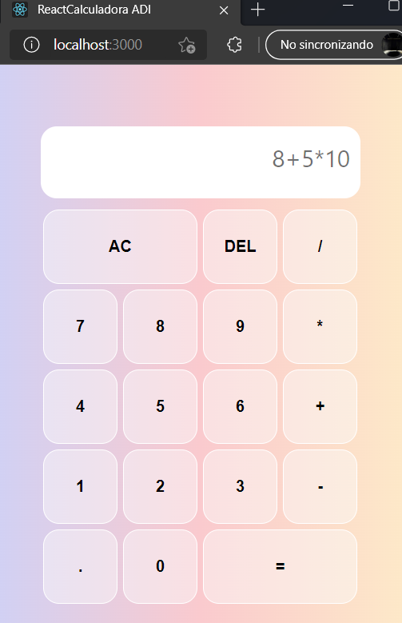

# ReactJS

Aplicaciones Distribuídas en Internet, Universidad de Alicante, curso 2020/21.
- Almilkar Cruz Orias
- Sameh Armouche

## Índice
1. [¿Por qué usar React?](#quees)
    1. [¿Por qué usar React?](#porque)
    2. [Características](#caracteristicas)
2. [Desarollo](#codigo)
    1. [Instalación](#install)
    2. [Implementación de un ejemplo: Calculadora](#calculadora)
    3. [Puesta en marcha](#marcha)
3. [Demo](#demo)
4. [Bibliografía](#biblio)

# <a name="quees"></a> 1. ¿Qué es React? 

React es una librería JavaScript de código abierto que te ayuda a crear interfaces de usuario sencillamente. Cuenta con un algoritmo muy eficiente para identificar las diferencias entre la representación virtual de la página actual y de la nueva. A partir de esas diferencias, hace los cambios necesarios en el Modelo de Objetos del Documento (DOM) de una manera muy dinámica. 

Utilizando React, obtienes HTML con toda la funcionalidad de JavaScript y adicionalmente el estilo gráfico de CSS centralizado y preparado para ser usado en cualquiera de tus proyectos. Así se define la propia librería y evidentemente, esa es su principal área de trabajo. Sin embargo, lo cierto es que en React encontramos un excelente aliado para hacer todo tipo de aplicaciones web, SPA (Single Page Application) o incluso aplicaciones para móviles. 

<a name="porque"></a> **¿Por qué usar React?**

En el diseño web es fundamental crear una interfaz de usuario que favorezca la transmisión de información, la navegabilidad y la interacción. React cuenta con una gran variedad de módulos, herramientas y componentes capaces de ayudarte a cubrir los objetivos que buscas al desarrollar tus aplicaciones, con relativamente poco esfuerzo. Es una base sólida para construir cualquier cosa con el programa de JavaScript. Por otro lado uno de los grandes fuerte para decidir porque usar este framework son sus características que comentaremos en el apartado siguiente.

<a name="caracteristicas"></a> **Características**

* **Composición de componentes**
    Así como en programación funcional se pasan funciones como parámetros para resolver problemas más complejos, creando lo que se conoce como composición funcional, en ReactJS podemos aplicar este mismo patrón mediante la composición de componentes
    Las aplicaciones se realizan con la composición de varios componentes. Estos componentes encapsulan un comportamiento, una vista y un estado.
* **Desarrollo Declarativo VS Imperativo**
    La forma imperativa de declarar nos obliga a escribir mucho código, porque cada pequeño cambio se debe definir en un script y cuando el cambio puede ser provocado desde muchos sitios, cuando agregamos eventos, el código comienza a ser poco mantenible.
    Sin embargo, el estilo de React es más declarativo, en el que nosotros contamos con un estado de la aplicación y sus componentes reaccionan ante el cambio de ese estado. Los componentes tienen una funcionalidad dada y cuando cambia una de sus propiedades ellos producen un cambio. En el código de nuestra aplicación tendremos ese componente, y en él se declarará de donde vienen los datos que él necesita para realizar su comportamiento.
* **Flujo de datos unidireccional**
    En este modelo de funcionamiento, los componentes de orden superior propagan datos a los componentes de orden inferior. Los de orden inferior trabajarán con esos datos y cuando cambia su estado podrán propagar eventos hacia los componentes de orden superior para actualizar sus estados.
* **Performance gracias al DOM Virtual**
    Nos referimos al desempeño a la hora del renderizado de la aplicación. Esto se consigue por medio del DOM Virtual. No es que React no opere con el DOM real del navegador, pero sus operaciones las realiza antes sobre el DOM Virtual, que es mucho más rápido.
    El DOM Virtual está cargado en memoria y gracias a la herramienta que diferenciación entre él y el real, el DOM del navegador se actualiza. El resultado es que estas operaciones permiten actualizaciones de hasta 60 frames por segundo, lo que producen aplicaciones muy fluidas, con movimientos suavizados.
* **Isomorfismo**
    Es la capacidad de ejecutar el código tanto en el cliente como el servidor. También se conoce como "Javascript Universal". Sirve principalmente para solucionar problemas de posicionamiento tradicionales de las aplicaciones Javascript.
* **Elementos y JSX**
    ReactJS no devuelve un HTML. El código embebido dentro de Javascript, parece HTML pero realmente es JSX. Son como funciones Javascript, pero expresadas mediante una sintaxis propia de React llamada JSX. Lo que produce son elementos en memoria y no elementos del DOM tradicional, con lo cual las funciones no ocupan tiempo en producir pesados objetos del navegador sino simplemente elementos de un DOM virtual.
* **Componentes con y sin estado**
    Los componentes stateless son los componentes que no tienen estado, digamos que no guardan en su memoria datos. Eso no quiere decir que no puedan recibir valores de propiedades, pero esas propiedades siempre las llevarán a las vistas sin producir un estado dentro del componente. Estos componentes sin estado se pueden escribir con una sencilla función que retorna el JSX que el componente debe representar en la página.
    No obstante, los componentes statefull son un poco más complejos, porque son capaces de guardar un estado y mantienen lógica de negocio generalmente. Su principal diferencia es que se escriben en el código de una manera más compleja, generalmente por medio de una clase ES6 (Javascript con ECMAScript 2015).
* **Ciclo de vida de los componentes**
    React implementa un ciclo de vida para los componentes. Son métodos que se ejecutan cuando pasan cosas comunes con el componente, que nos permiten suscribir acciones cuando se produce una inicialización, se recibe la devolución de una promesa, etc.

# <a name="codigo"></a> 2. Desarollo

Para comenzar a utilizar Rreact pasaremos primero a instalarlo, posteriomente veremos como si crea un nuevo proyecto y finalmente la puesta en marcha del pequeño proyecto. Para explicar todo esto usaremos como ejemplo una calculadora hecha en ReactJS.

<a name="install"></a> **Instalación**

Primero comenzaremos instalando el framework. Para ello, abriremos un terminal e introduciremos el siguiente comando:

```console
$ npm install -g create-react-app
```
El proceso de instalación puede tardar unos minutos.

Nota: cabe destacar que para instalar React debemos tener el gestor npm instalado en nuestro sistema. A continuación se deja un enlace de como instalarlo:
- https://docs.npmjs.com/cli/v6/commands/npm-install

Cuando tengamos ya descargado e instalado ReactJS, crearemos una nueva carpeta, que será donde se crearan los archivos necesarios para iniciar nuestro proyecto, en este caso será una calculadora. Nos dirigimos al 
a la carpera creada y ella abrimos un terminal. En el introducimos el siguiente comando: 

```console
$ create-react-app mi-app
```
Mediante el comando anterior se cargarán los archivos de un proyecto vacío y todas las dependencias de npm para poder contar con el tooling que hemos mencionado. Una vez terminado el proceso, que puede tardar un poco, podemos entrar dentro de la carpeta de nuestra nueva app. Nos dirigimos a la carpeta creada con:

```console
$ cd mi-app/
```
Y una vez dentro hacemos que nuestra app se inicie con:
```console
$ npn start 
```

Por último, en el navegador nos dirigmos a la dirección http://localhost:3000 y veremos nuestra app corriendo.

<a name="calculadora"></a> **Implementación de un ejemplo: Calculadora**

Después de realizar todos los pasos anteriores vemos que la estructura de carpetas generada es la siguiente:

```console
my-app/
├─ node_modules/
├─ public/
│  ├─ favicon.ico
│  ├─ index.html
│  ├─ robots.txt
│  ├─ *
├─ src/
│  ├─ index.css
│  ├─ index.js
│  ├─ App.js
│  ├─ App.css
│  ├─ *
├─ .gitignore
├─ package.json
├─ README.md
├─ *
```
Para poder comenzar a programar nuestra calculadora nos dirigmos a src/App.js que será donde se encuentra la lógica de nuestro proyecto. En este archivo nos encontraremos con el código listado a continuación que explicaremos por partes.

Si nos fijamos en la primeras lineas, vemos que se nos está importando todo lo relacionado con React, además de una primera toma de contacto de como estructura el código este framework:

```js
import './App.css';
import {useState} from 'react';
import * as math from "mathjs";

function App() { ... }
```

Como vemos, en el fragmento de código de arriba, aparte de importar el useState que usa React vemos que importamos otra cosas como ¨App.css¨, que se trata de un archivo de estilos CSS que contradrá nuestra proyecto, y la librería ¨MathJS¨ que nos ayudará con la lógica de nuestra calculadora. 

Respecto a la lógica de nuestra calculdora quedaría de la siguiente forma: 

```js
  function clickValue(val){ setResult(''); setOperation(operation+val) }
  function clickEqual(){ setOperation(""); setResult(math.evaluate(operation)) }
  function clickAC(){ setOperation("") }
  function clickDel(){ setOperation(operation.substring(0,operation.length-1)) }
  return (
    <div className="App">
      <div className="calculator-grid">
        <div className="output">
          <div className="operation">{operation}</div>
          <div className="result">{result}</div>
        </div>
        <button className="span-two"  onClick={()=> {clickAC()}} >AC</button>
          <button onClick={()=> {clickDel()}} >DEL</button>
          <button onClick={()=> {clickValue('/')}}>/</button>
          <button onClick={()=> {clickValue(7)}}>7</button>
          <button onClick={()=> {clickValue(8)}}>8</button>
          <button onClick={()=> {clickValue(9)}}>9</button>
          <button onClick={()=> {clickValue('*')}}>*</button>
          <button onClick={()=> {clickValue(4)}}>4</button>
          <button onClick={()=> {clickValue(5)}}>5</button>
          <button onClick={()=> {clickValue(6)}}>6</button>
          <button onClick={()=> {clickValue('+')}}>+</button>
          <button onClick={()=> {clickValue(1)}}>1</button>
          <button onClick={()=> {clickValue(2)}}>2</button>
          <button onClick={()=> {clickValue(3)}}>3</button>
          <button onClick={()=> {clickValue('-')}}>-</button>
          <button onClick={()=> {clickValue('.')}}>.</button>
          <button onClick={()=> {clickValue(0)}}>0</button>
          <button onClick={()=> {clickEqual()}}className="span-two">=</button>
      </div>
    </div>
  );
```
Para nos dejar esta parte sin explicación haremos una breve explicación del código de arriba:

- **operation**: en esta variable se va guardando todo lo que introduce el usuario para construir la operación deseada.
- **result**: en esta variable se guarda el resultado de la operación una vez el usuario teclea '=' y se muestra vaciando la operación.

- **MathJS**: se ha empleado esta librería para calcular el resultado a partir de un string con el metodo __math.evaluate(operation)__;

- Se ha implementado todas las funciones necesarios para el correcto funcionamiento:
    - __clickValue(val)__: Se va añadiendo cada tecla del usuario en la variable operation.
    - __clickEqual()__: Se va a calcular el resultado y vaciar la operación.
    - __clickAC()__: Se vaciará el input "operation".
    - __clickDel()__: Se eliminara el ultimo caracter introducido por el usuario. 

<a name="marcha"></a> **Puesta en marcha**

Una vez acabado la implementación de nuestra calculadora pasaremos a probarla, para ello abrimos un terminal escribimos el siguiente comando:

```sh
$ npm start
```

Finalmente nos dirigimos a la dirección http://localhost:3000 y veremos nuestra calculadora corriendo.



# <a name="demo"></a>3. Demo

Una breve demo del funcionamiento del proyecto.

- https://drive.google.com/file/d/1jlppfq8wvfCB0ZOJBaozs7DRfm0QJpyJ/view?usp=sharing

# <a name="biblio"></a>4. Bibliografía 

- https://reactjs.org/docs/getting-started.html
- https://reactjs.org/docs/hooks-reference.html#functional-updates
- https://en.wikipedia.org/wiki/React_(JavaScript_library)
- https://www.simplilearn.com/tutorials/reactjs-tutorial/what-is-reactjs


